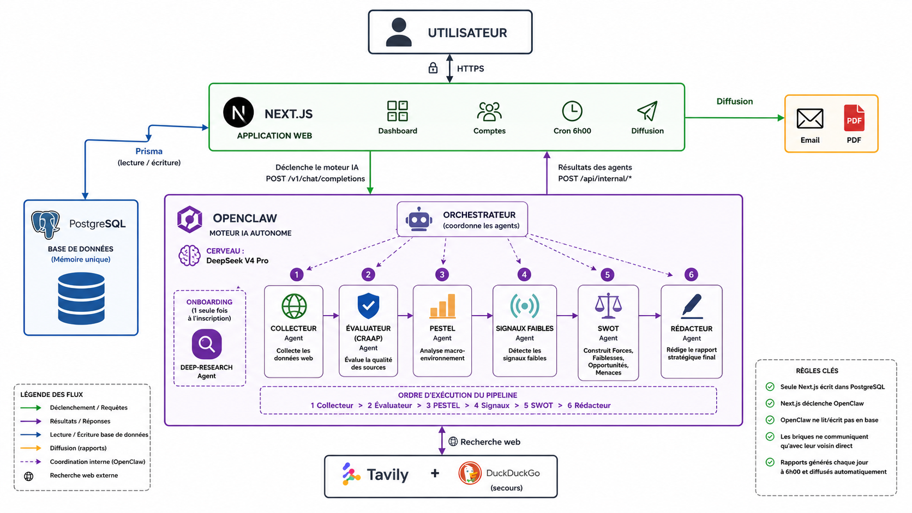

<div align="center">

# RADAR

### Vos concurrents bougent. Radar vous le dit avant tout le monde.


</div>

---

## Ce que fait RADAR

RADAR est une plateforme de **veille concurrentielle automatique**.

Vous entrez le nom de votre entreprise. Un agent IA autonome parcourt le web, identifie vos concurrents, analyse leurs mouvements, et vous livre chaque semaine un rapport clair : forces et faiblesses (SWOT), tendances du secteur (PESTEL), signaux faibles à surveiller, et une synthèse actionnable. Le tout sans aucune intervention humaine.

Vous consultez les rapports dans un dashboard et vous les exportez en PDF.

---

## Le problème, et notre solution

**Le problème.** Dans une PME, personne n'a le temps de surveiller les concurrents chaque semaine, de vérifier les informations, puis de les mettre en forme. Résultat : on découvre les mouvements trop tard, les rumeurs se mélangent aux faits, et aucune synthèse n'est produite.

**La solution.** RADAR confie tout ce travail à un agent IA qui applique la méthodologie de veille du module M244 (CRAAP pour évaluer les sources, SWOT, PESTEL, détection de signaux faibles) et produit un rapport fiable, automatiquement.

---

## Schéma global du système



Trois services communiquent sur un réseau Docker privé : l'**application web** (interface + base de données), le **moteur OpenClaw** (l'agent et ses 8 compétences), et **PostgreSQL**. Le moteur n'est jamais exposé sur Internet : il dialogue avec le web uniquement via les routes `/api/internal/*`.

---

## Architecture des fichiers

```
radar/
├── apps/
│   ├── web/                          Application Next.js (interface + persistance)
│   │   ├── src/
│   │   │   ├── app/
│   │   │   │   ├── (app)/             Pages protégées : dashboard, competitors, cycles,
│   │   │   │   │                      reports, swot, pestel, weak-signals, settings
│   │   │   │   ├── (auth)/            Connexion / inscription
│   │   │   │   ├── onboarding/        Saisie du profil entreprise
│   │   │   │   └── api/
│   │   │   │       ├── auth/[...all]/ Authentification Better Auth (email + Google)
│   │   │   │       └── internal/      Routes écrites par l'agent :
│   │   │   │                          profil, sources, swot, pestel, signaux, rapport
│   │   │   ├── components/            Composants UI
│   │   │   └── lib/                   actions, agents (client OpenClaw), auth,
│   │   │                              dashboard, onboarding, validators
│   │   └── public/                   Assets statiques
│   │
│   └── agent/                        Moteur de veille (OpenClaw)
│       ├── workspace/skills/         Les 8 compétences de l'agent (1 fichier SKILL.md chacune)
│       │   ├── orchestrateur/        Coordonne tout le cycle de veille
│       │   ├── deep-research/        Construit le profil entreprise (à l'inscription)
│       │   ├── collecteur/           Recherche web des concurrents (Tavily)
│       │   ├── evaluateur/           Note chaque source avec la méthode CRAAP
│       │   ├── analyste-swot/        Produit la matrice SWOT
│       │   ├── analyste-pestel/      Produit l'analyse PESTEL du secteur
│       │   ├── detecteur-signaux-faibles/  Détecte les signaux faibles
│       │   └── redacteur/            Rédige la synthèse finale
│       ├── openclaw-data/            Config et état OpenClaw (modèle, auth, plugins)
│       └── openclaw.json             Configuration du moteur
│
├── packages/
│   ├── database/                     Schéma Prisma + client partagé (@radar/database)
│   │   └── prisma/schema.prisma      17 modèles (User, Rapport, Swot, Pestel, Source...)
│   └── contracts/                    Schémas Zod partagés web <-> agent (@radar/contracts)
│
├── infra/docker/
│   ├── stack-complet/
│   │   ├── docker-compose.yml        Stack principale : postgres + openclaw + web
│   │   ├── docker-compose.mock.yml   Surcouche OPTIONNELLE : remplace le web par un mock
│   │   │                             pour tester l'agent sans build Next.js
│   │   ├── docker-compose.openclaw-only.yml  Mode dev hybride (Next.js lancé sur l'hôte)
│   │   └── initdb/01-init.sql        Schéma appliqué AUTOMATIQUEMENT au 1er démarrage de Postgres
│   ├── web/Dockerfile                Image de l'application Next.js (build standalone)
│   └── mock-api/                     Faux service web pour les tests de l'agent
│
├── docs/                             PRD, rapport M244, charte graphique, schéma global (PNG)
├── Branding/                         Charte Radar Editorial (logo, couleurs, tokens)
├── .env.example                      Modèle de configuration à copier en .env
├── pnpm-workspace.yaml / turbo.json  Monorepo pnpm + Turborepo
└── README.md
```

---

## Stack technique

| Couche          | Choix                                                                 |
| --------------- | --------------------------------------------------------------------- |
| Monorepo        | pnpm 10 (workspaces) + Turborepo                                      |
| Application web | Next.js 16 (App Router) + React 19 + TypeScript 5 + Tailwind CSS 4    |
| Authentification| Better Auth (email / mot de passe + Google OAuth)                    |
| Moteur agent    | OpenClaw (`ghcr.io/openclaw/openclaw:latest`, port interne 18789)     |
| Modèle LLM      | DeepSeek V4 Pro (`deepseek/deepseek-v4-pro`, thinking medium)         |
| Recherche web   | Tavily (primaire) + DuckDuckGo (fallback)                            |
| Base de données | PostgreSQL 17 + Prisma 6                                             |
| Contrats        | Zod (`@radar/contracts`)                                            |
| Infrastructure  | Docker Compose (postgres + openclaw + web)                          |

---

## Démarrage local

**Prérequis :** uniquement **Docker Desktop** (lancé). Pas besoin d'installer Node ni pnpm : tout tourne dans des conteneurs.

```bash
# 1. Cloner le projet
git clone <url-du-repo> radar
cd radar

# 2. Créer le fichier de configuration
cp .env.example .env
```

Ouvrez `.env` et renseignez au minimum :

| Variable                  | Comment l'obtenir                                            |
| ------------------------- | ----------------------------------------------------------- |
| `DEEPSEEK_API_KEY`        | Clé API DeepSeek (https://platform.deepseek.com)            |
| `TAVILY_API_KEY`          | Clé API Tavily (https://tavily.com)                         |
| `BETTER_AUTH_SECRET`      | Générer un secret : `openssl rand -hex 32`                  |
| `OPENCLAW_INTERNAL_SECRET`| N'importe quelle valeur secrète (partagée web <-> agent)    |

Les identifiants Google sont optionnels : la connexion par email / mot de passe fonctionne sans eux.

```bash
# 3. Lancer toute la stack (postgres + openclaw + web)
cd infra/docker/stack-complet
docker compose --env-file "../../../.env" up -d --build
```

Au premier démarrage, Postgres crée automatiquement le schéma (via `initdb/01-init.sql`), l'image web se construit, puis les 3 services démarrent. Ouvrez ensuite :

**http://localhost:3000**

Créez un compte, faites l'onboarding (nom de votre entreprise), puis lancez un cycle de veille depuis le dashboard. Suivez l'agent en direct avec `docker logs -f radar-openclaw`.

### Commandes utiles

```bash
# Depuis infra/docker/stack-complet/
docker compose ps                       # état des 3 services
docker compose logs -f web              # logs du site
docker compose logs -f openclaw         # logs de l'agent
docker compose down                     # tout arrêter (garde la base)
docker compose down -v                  # tout arrêter et effacer la base

# Tester le pipeline agent sans build Next.js (mode mock) :
docker compose -f docker-compose.yml -f docker-compose.mock.yml --env-file "../../../.env" up -d
```

---

## État d'avancement

**Version 1 fonctionnelle.** Le pipeline agent et l'application web sont opérationnels et connectés. Un test d'intégration de bout en bout a été mené sur un compte réel (entreprise **inwi**, concurrents Orange Maroc et Maroc Telecom) : rapports produits, persistés et affichés dans le dashboard, avec un score CRAAP moyen de 16/20.

- [x] Moteur agent : 8 compétences, pipeline séquentiel complet
- [x] Application web : authentification, onboarding, dashboard, SWOT / PESTEL, export PDF
- [x] Communication agent <-> web via routes internes
- [x] Infrastructure Docker auto-suffisante (base locale + schéma automatiques)
- [ ] Déclenchement automatique programmé (aujourd'hui : bouton manuel)
- [ ] Déploiement en production (VPS)

---

## Améliorations futures

- **Déclencheur automatique** : aujourd'hui, le cycle de veille se lance manuellement (un bouton dans le dashboard). Automatiser le déclenchement programmé (cron hebdomadaire, le lundi à 6h00) pour une veille réellement autonome, sans aucun clic.
- **Déploiement VPS** : mise en ligne pour un accès permanent et l'exécution du cron côté serveur.
- **Notifications automatiques** : envoi du rapport par email à heure fixe après chaque cycle.
- **Google OAuth en production** : remplacer les identifiants placeholder par de vrais identifiants.
- **Migrations versionnées** : passer de `initdb/01-init.sql` à des migrations Prisma suivies, pour faire évoluer le schéma proprement.
- **Tests automatisés** : couverture des routes internes et du pipeline agent.
- **Passage à l'échelle** : gestion de nombreux utilisateurs simultanés et historique de veille enrichi.

---

<div align="center">

### Karamo Sylla &nbsp;&nbsp;&middot;&nbsp;&nbsp; Bachirou Konaté

_Binôme - Cycle Ingénieur Big Data & Intelligence Artificielle_

</div>

<br>

> **Encadrant** &nbsp; Pr. Younes Wadiai
> **Module** &nbsp; M244 - Veille Technologique, ENSA Tétouan
> **Session** &nbsp; Printemps 2026
